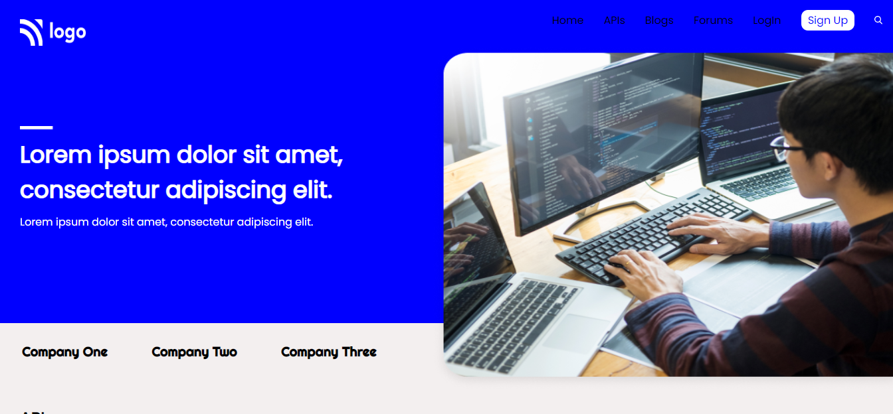

# Project 08: Developer Landingpage using HTML  and CSS 

Chandrakala P

## Final Look of the Webpage:

### Live project Link:

[project link](https://we-design-page-project8.netlify.app/)

## What I learnt from this Project?

- This project helped me to understand the whole idea of Html and css
- I learnt most of the basics tags in html and many properties in css.
- To understand how to use CSS selectors.
- It helped me to understand more about css variables, css selectors etc.
- It's a long webpage, helped me to undertsand more about structuring of elements.
- This project helped me to understand background-img and bgc, buttons, text-decoration in css and also positioning in css and many more.

## Stacks and Tools:

- HTML and CSS
- HTML : list, p, div, li, ul, ol, heading tags, button, img, and many more.
- CSS: margin, padding, bgc, color, posiiton text-decorations align items, display, flex, text align, justify content, gap, bgi, border, border-radius etc.

## It took around 4.5 hrs.
